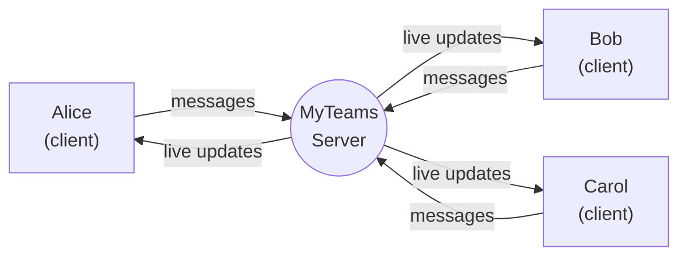
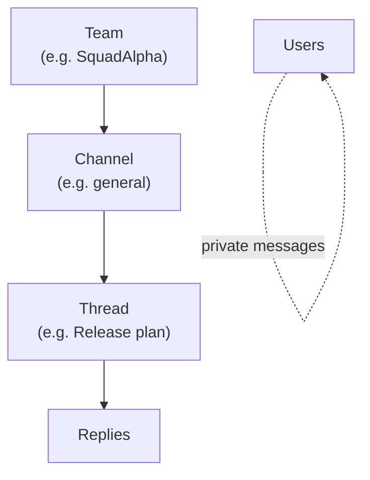
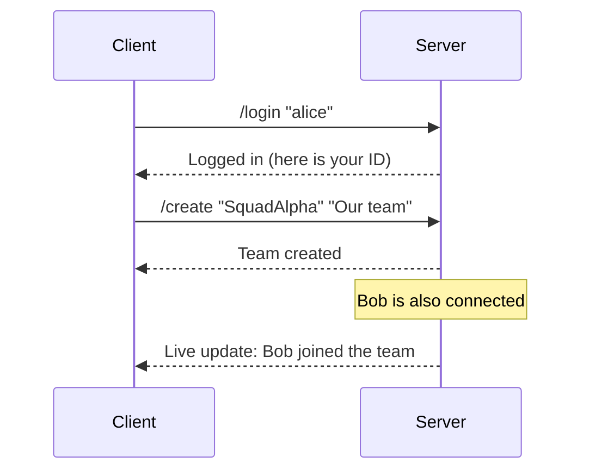

# MyTeams


**A chat platform like Microsoft Teams — rebuilt from scratch, and fully yours.**

MyTeams lets a group of people talk to each other over a network: send private
messages, create teams, open discussion channels, start threads, and reply to
each other. Everything runs on your own machine — no cloud, no accounts, no
outside company involved.

---

## In plain words

Think of MyTeams as two programs working together:

- **The server** is the "meeting room." It stays running and keeps track of
  every user, team, and message. You start it once and leave it on.
- **The client** is what each person uses to walk into that room, type
  messages, and read replies. Everyone runs their own client.



Because the server remembers everything, it can save its state when you shut it
down and load it back when you start it again — so no conversation is lost.

---

## What you can do

| Feature | What it means |
|---|---|
| **Private messages** | Send a direct message to one person. |
| **Teams** | Create a group (like a company department). |
| **Channels** | Topic-based rooms inside a team. |
| **Threads** | Start a focused discussion inside a channel. |
| **Replies** | Answer a specific thread. |
| **Live updates** | Everyone sees new activity the moment it happens. |
| **Saved history** | The server reloads all data after a restart. |

### How the pieces fit together



---

## Getting started

### 1. What you need

- A Linux machine with **GCC/G++** (C++17 support)
- The `uuid` development library:
  ```bash
  sudo apt install uuid-dev
  ```
- The provided logging library (already included at `libs/myteams/`)

### 2. Build it

```bash
make        # builds both programs: the server and the client
make clean  # removes temporary build files
make fclean # removes build files and the programs
make re     # rebuild everything from scratch
```

This creates two programs: `myteams_server` and `myteams_cli`.

### 3. Run it

Start the server (pick any free port number, e.g. `4242`):

```bash
./myteams_server 4242
```

> The server saves its state when you press `Ctrl-C`, and reloads it the next
> time you start it.

Then, in another terminal, connect a client:

```bash
./myteams_cli 127.0.0.1 4242
```

`127.0.0.1` means "this same computer." To connect from another machine, use
the server's IP address instead.

---

## Using the client

Once connected, type commands starting with `/`.
**All values must be wrapped in double quotes.**

| Command | What it does |
|---|---|
| `/help` | Show the command list |
| `/login "name"` | Log in (creates the user if new) |
| `/logout` | Disconnect |
| `/users` | List all users |
| `/user "uuid"` | Show details about a user |
| `/send "uuid" "message"` | Send a private message |
| `/messages "uuid"` | Show your conversation with a user |
| `/subscribe "team_uuid"` | Join a team |
| `/subscribed` | List teams you joined |
| `/subscribed "team_uuid"` | List members of a team |
| `/unsubscribe "team_uuid"` | Leave a team |
| `/use` | Reset your current location |
| `/use "team_uuid"` | Move into a team |
| `/use "team_uuid" "channel_uuid"` | Move into a channel |
| `/use "team_uuid" "channel_uuid" "thread_uuid"` | Move into a thread |
| `/create ...` | Create something (see below) |
| `/list` | List what is inside your current location |
| `/info` | Show details about your current location |

### `/create` adapts to where you are

The same command creates different things depending on your current location:

| Where you are | Command | Creates |
|---|---|---|
| Nowhere | `/create "name" "description"` | A **team** |
| Inside a team | `/create "name" "description"` | A **channel** |
| Inside a channel | `/create "title" "body"` | A **thread** |
| Inside a thread | `/create "body"` | A **reply** |

---

## Example session

```bash
# Terminal 1 — the server
./myteams_server 4242

# Terminal 2 — Alice
./myteams_cli 127.0.0.1 4242
/login "alice"
/create "SquadAlpha" "Our team"
/use "<team_uuid>"
/create "general" "General channel"
/list

# Terminal 3 — Bob
./myteams_cli 127.0.0.1 4242
/login "bob"
/list
/subscribe "<team_uuid>"
/send "<alice_uuid>" "Hey Alice!"
```

---

## Under the hood (for the curious)

MyTeams talks to itself using a custom network language called **MTP/1.0**
(MyTeams Protocol). Every message is a small packet: a fixed 6-byte header
that says *what kind* of message it is and *how big* it is, followed by the
actual content.



The full technical specification lives in [`doc/RFC.md`](doc/RFC.md).

### Project layout

```
.
├── Makefile
├── README.md
├── doc/
│   ├── RFC.md              # Full protocol specification (MTP/1.0)
│   └── doxygen/            # Generated code documentation
├── include/               # Shared data structures and protocol codes
├── libs/
│   └── myteams/            # Provided logging library
├── src/
│   ├── server/             # The server program and its command handlers
│   └── client/             # The command-line client program
└── tests/
    └── integration_test.sh # Automated end-to-end test
```

---

## Documentation

Generate browsable code documentation with Doxygen:

```bash
make doc        # builds the HTML docs
make doc-clean  # removes them
```

---

## Tests

```bash
chmod +x tests/integration_test.sh
./tests/integration_test.sh          # uses port 4242
./tests/integration_test.sh 9090     # uses a custom port
```

The test covers: multi-client login, team/channel/thread/reply creation,
private messaging, subscriber isolation, saved state after restart, error
handling, and blocking access before login.

---

## About this project

MyTeams was built from scratch in C++17 as a study in network programming:
socket handling, a poll-based event loop, a custom binary protocol, and
persistent state — all with no external framework.
